# [SPARK!] Boston Housing Code Violations: Property-Level Risk Prioritization

**Course:** CS506 Final Project  
**Group:** Mengxing Wang, Jiacheng He, Xiao Luo, Renwei Li  
**Presentation video:** [https://youtu.be/oyae1mPDLSI?si=pQLfOaeTrLrzhNRC](https://youtu.be/oyae1mPDLSI?si=pQLfOaeTrLrzhNRC)
<br>
<br>

## 1. How to Build and Run

Supported environment: Python 3.10+ on macOS, Windows, or Linux, also Jupyter Notebook

### Makefile
Install dependencies and run the test:

```bash
make install
make test
```

Reproduce the final model outputs and figures from the committed processed feature table:

```bash
make model
```
> [!IMPORTANT]
> If you want to run the entire pipeline and want a comprehensive process, please run the following command instead of `make model` 😊 ↓

To reproduce the full notebook pipeline from the source tables:

```bash
make notebooks
```
> [!CAUTION]
> The full pipeline expects the large Boston Property Assessment file at:
>
> ```text
> ./data/external/boston_property_assessment_data.csv
> ```
> This file is not committed because of its size. The repository includes the processed tables needed to rerun the final model with `make model`.
> PLEASE DOWNLOAD from here [Analyze Boston - Property Assessment](https://data.boston.gov/dataset/property-assessment) and make sure you download the correct version: Property Assessment FY2025 version csv file and change the file name to fit the purpose.

### If Makefile does not work

don't forget to check above before you run the following commands.

On Windows PowerShell, run:

```powershell
py -3.11 -m venv .venv
.\.venv\Scripts\Activate.ps1

pip install --upgrade pip
pip install -r requirements.txt

python -m jupyter nbconvert --to notebook --execute --inplace notebooks/01_data_collection.ipynb
python -m jupyter nbconvert --to notebook --execute --inplace notebooks/02_data_cleaning.ipynb
python -m jupyter nbconvert --to notebook --execute --inplace notebooks/03_eda_visualization.ipynb
python -m jupyter nbconvert --to notebook --execute --inplace notebooks/04_feature_engineering.ipynb
python -m jupyter nbconvert --to notebook --execute --inplace notebooks/05_modeling.ipynb
```

On macOS/Linux, run:

```bash
python3 -m venv .venv
source .venv/bin/activate

pip install --upgrade pip
pip install -r requirements.txt

python -m jupyter nbconvert --to notebook --execute --inplace notebooks/01_data_collection.ipynb
python -m jupyter nbconvert --to notebook --execute --inplace notebooks/02_data_cleaning.ipynb
python -m jupyter nbconvert --to notebook --execute --inplace notebooks/03_eda_visualization.ipynb
python -m jupyter nbconvert --to notebook --execute --inplace notebooks/04_feature_engineering.ipynb
python -m jupyter nbconvert --to notebook --execute --inplace notebooks/05_modeling.ipynb
```
> [!TIP]
> or if you want, after you setup the environment, you can just run by clicking the run button in notebooks.

---

The notebooks run in this order:

```text
notebooks/01_data_collection.ipynb
notebooks/02_data_cleaning.ipynb
notebooks/03_eda_visualization.ipynb
notebooks/04_feature_engineering.ipynb
notebooks/05_modeling.ipynb
```

Main and important generated outputs:

- `data/processed/violations_clean.csv`  
  Cleaned violation records with parsed dates, cleaned locations, neighborhood labels, and deduplicated cases.

- `data/processed/properties_clean.csv`  
  Cleaned FY2025 residential property records with parcel features, coordinates, and neighborhood labels.

- `data/processed/spatial_join_summary.csv`  
  Summary of the violation-to-property snapping step, including match count, snap rate, and snapping distance.

- `data/processed/properties_with_violations.csv`  
  Property-level table with the target variable `had_violation`.

- `data/processed/property_model_features.csv` and `data/processed/property_feature_columns.json`  
  Final modeling inputs, including selected features and recorded leakage exclusions.

- `data/processed/classification_model_metrics.csv` and `data/processed/classification_prioritization_summary.csv`  
  Final model metrics and top-decile prioritization results.

- `figures/01_target_distribution.png` through `figures/13_cumulative_gain.png`  
  EDA and model performance figures used in the report.
<br>
<br>

## 2. Project Goal

Our original idea was to predict the 2026 housing violation rate for each Boston neighborhood. After cleaning and merging the data, we found that this setup was not reliable enough. The number of neighborhoods was small, and the 2026 records were only partial. As a result, the neighborhood-level prediction task became too unstable for a meaningful supervised model.

We therefore reframed the project as a property-level risk prioritization problem. Boston provides both violation records and parcel-level Property Assessment data. By combining these sources, we can connect historical violations with property characteristics such as building age, land use, assessed value, condition, and location.

Our final research question is:

> Can structural, locational, and neighborhood-level property features help identify residential parcels that are more similar to properties with historical housing or building violations?

We define the target as:

```text
had_violation = 1 # if any violation record was snapped to this parcel within 50 meters
had_violation = 0 otherwise
```

The model uses this historical label for training, but the goal is not just to look up past violations. Instead, we use the model to rank residential properties by how similar they are to historically cited properties. The predicted score is an inspection-prioritization score, not proof of a current violation and not a guaranteed prediction of a future one.
<br>
<br>

## 3. Data Sources & Collection

The project uses five main source files:

- `data/raw/violations.csv`  
  Building and property violation records from [Analyze Boston](https://data.boston.gov/dataset/building-and-property-violations1). This file provides violation dates, codes, status, addresses, and coordinates.

- `data/external/boston_property_assessment_data.csv`  
  FY2025 Property Assessment data from [Analyze Boston](https://data.boston.gov/dataset/property-assessment). This file provides parcel-level property features, including building age, land use, assessed value, size, condition, and coordinates.

- `data/external/boston_neighborhood_boundaries.geojson`  
  Boston neighborhood boundary data from [Analyze Boston](https://data.boston.gov/dataset/bpda-neighborhood-boundaries). This file is used for spatial neighborhood assignment.

- `data/external/boston_population_estimates_2025_neighborhood_level.csv`  
  2025 neighborhood population estimates from [Analyze Boston](https://data.boston.gov/dataset/2025-boston-population-estimates-neighborhood-level). This file provides population context for neighborhood-level features.

- `data/external/code-violations-data-dictionary.xlsx`  
  Official violation code reference from Boston Inspectional Services Department. This file is used as supporting documentation for the violation code fields.

Notebook 01 verifies that the source files first, and then inspects the raw violation schema and checks the date range and duplicate case numbers; Then writes `data/processed/dataset_summary.json`. It also creates `data/external/neighborhood_population.csv`, a smaller population lookup table used by later notebooks.

After initial validation, we found the raw violation table contains 17,172 records, 520 unique violation codes, and dates from 2009-12-01 through 2026-03-20. The FY2025 Property Assessment file contains 182,241 parcel rows before filtering.

A second derived table, `data/external/neighborhood_structural_features.csv`, is created later in Notebook 02. It summarizes property assessment features by neighborhood, such as property count, building age, housing type mix, and properties per 1,000 residents.
<br>
<br>

## 4. Data Cleaning

Notebook 02 cleans the violation records and the FY2025 property assessment data. The goal is to convert case-level violation records into a property-level modeling table.

For violation records, we parsed dates and cleaned location fields. We also removed duplicate case records. Neighborhood assignment was the main challenge. Our first version mapped generic `Boston` labels to `Downtown`, but this created an unrealistic Downtown concentration. We changed it to a three-step method: use clear city labels first, then use point-in-polygon matching, and use ZIP code as the final fallback.

For property records, we kept residential parcels with valid coordinates and neighborhood labels. We cleaned property value, area, unit counts, bathroom counts, and year built. We also created structural features such as `building_age_2025`, `is_condo`, and `is_multifamily`.

The final step maps violations to properties. Each violation with valid coordinates is snapped to the nearest residential parcel using a haversine BallTree. We keep the match only if it is within 50 meters. This matched 16,201 of 16,700 coordinate-valid violations, with a 97.01% snap rate.

After this mapping, we aggregate violations to one row per property. The target is `had_violation`, where 1 means at least one violation was snapped to that property. The final table has 169,077 residential properties. Among them, 9,484 are positive cases, which gives a 5.61% positive class rate.
<br>
<br>

## 5. Feature Extraction

Notebook 04 creates the final modeling table, `data/processed/property_model_features.csv`. Each row represents one residential property. The target is `had_violation`.

Model features include:

| Feature group | Examples | Why included |
|---|---|---|
| Parcel structure | `building_age_2025`, `TOTAL_VALUE`, `LIVING_AREA`, `GROSS_AREA`, `LAND_SF`, `RES_UNITS`, `BED_RMS` | These features describe the age, size, value, and basic structure of the property. |
| Structural flags | `is_pre_1940`, `is_pre_1900`, `was_remodeled`, `is_condo`, `is_multifamily` | These features summarize older housing stock and property type in a simple way. |
| Property condition and type | `LU_DESC`, `BLDG_TYPE`, `STRUCTURE_CLASS`, `OVERALL_COND`, `INT_COND`, `EXT_COND`, `HEAT_TYPE`, `AC_TYPE`, `OWN_OCC` | These fields describe how the property is used and what condition it is in. |
| Location | `neighborhood`, `geocode_latitude`, `geocode_longitude` | Location helps capture spatial patterns in historical violations. |
| Neighborhood context | `population_2025`, `property_count`, `share_pre_1940`, `share_condo`, `share_multifamily`, `properties_per_1000_residents` | These features add broader neighborhood housing and population context. |

To avoid data leakage, the model does not use fields that directly come from violation outcomes:

```text
violation_count
recent_violation_count
had_recent_violation
last_violation_date
first_violation_date
```

The final numeric and categorical feature lists are stored in `data/processed/property_feature_columns.json`. Notebook 05 reads this file before training and checks that the leakage fields are not used as model inputs.
<br>
<br>

## 6. Data Visualization

The EDA and modeling notebooks save figures in `figures/`. These plots show that historical violations vary by property type, neighborhood, value, age, and location.

### Violation Distribution

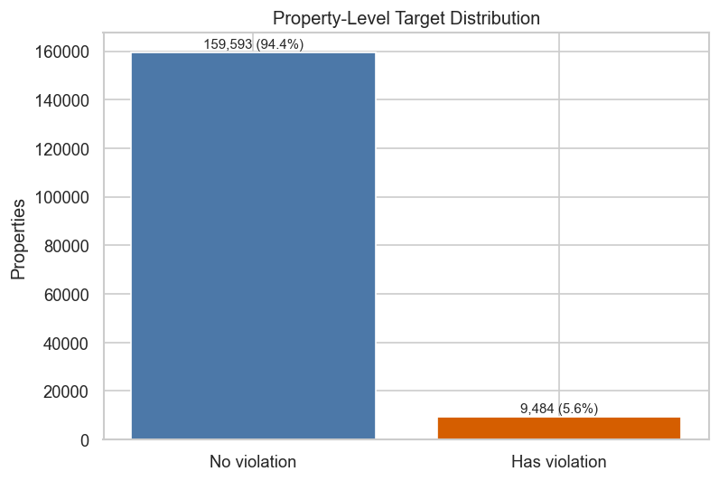

Only 5.61% of residential properties have a snapped historical violation. This creates an imbalanced task, so we can get that accuracy alone is not a reliable factor.

### Violation Rate by Building Age

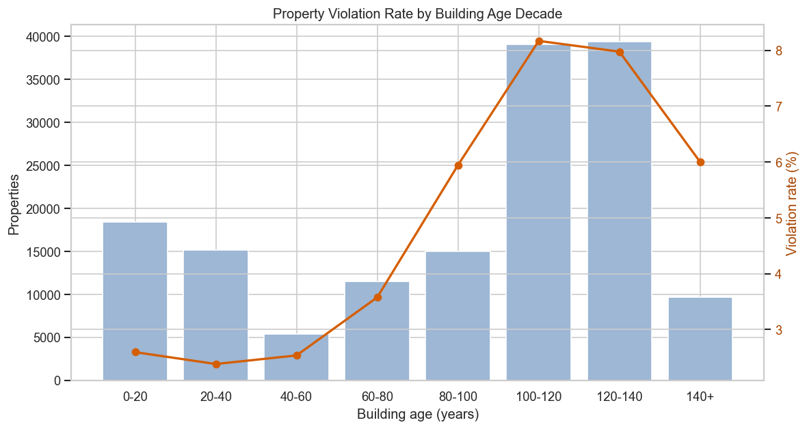

The violation rate is higher for older properties, especially properties around 100-140 years old. This supports including building age, but the pattern is not perfectly monotonic, so age alone is not sufficient.

### Violation Rate by Property Type

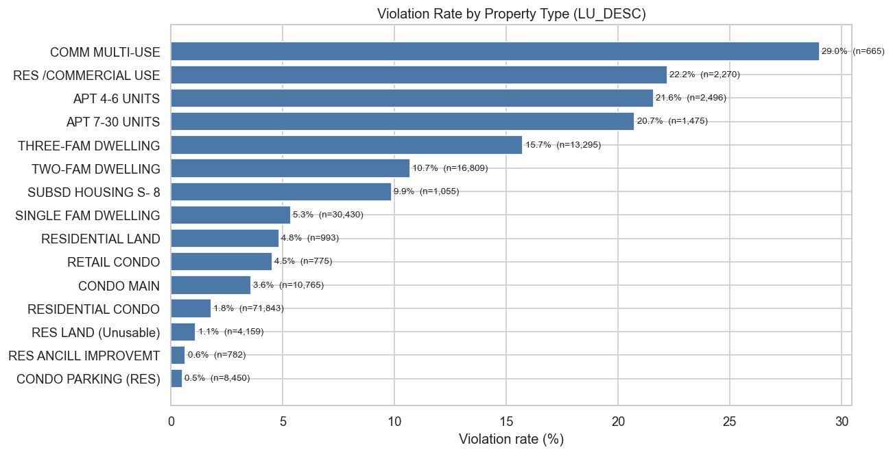

Property type is strongly associated with the target. Multi-use, apartment, and multi-family categories have higher observed violation rates than single-family or condo-only categories.

### Violation Rate by Neighborhood

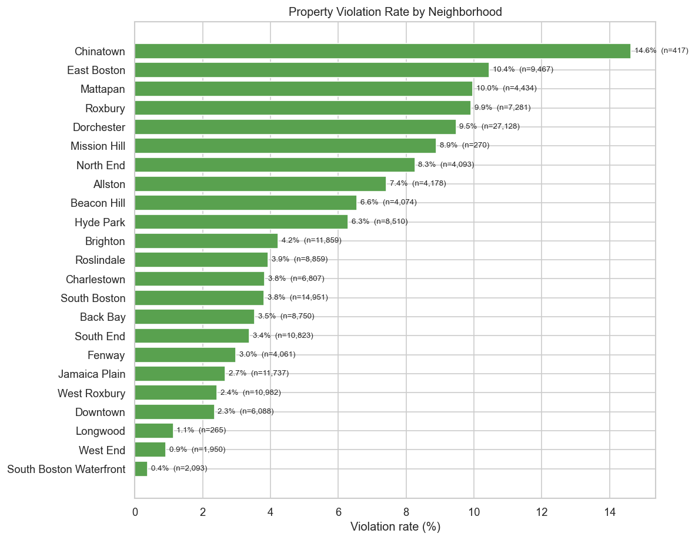

Violation rates vary substantially by neighborhood. This supports the use of location features, while also showing why the model should be interpreted as a prioritization tool rather than causal proof.

### Violation Rate by Property Value Quintile

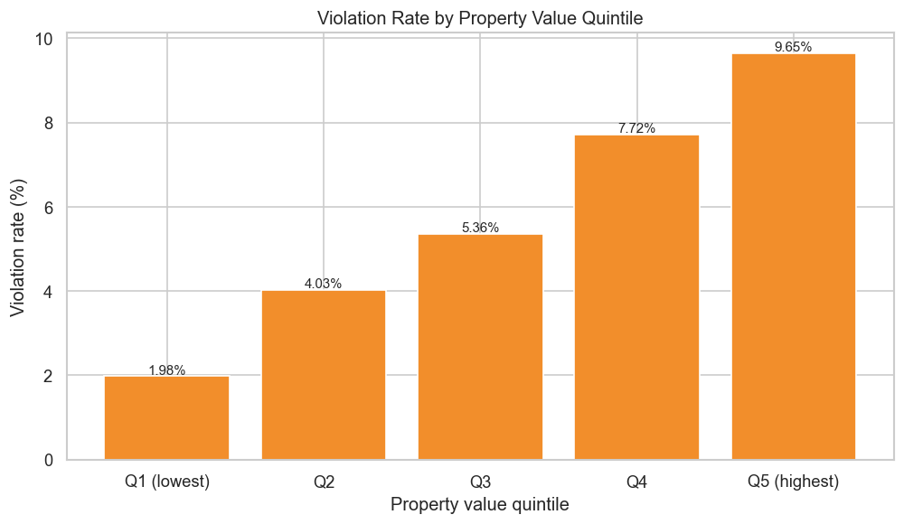

Properties are split into five groups by assessed total value. Higher-value groups have higher observed violation rates. This pattern may also reflect neighborhood, property size, property type, or inspection intensity.

### Spatial Distribution

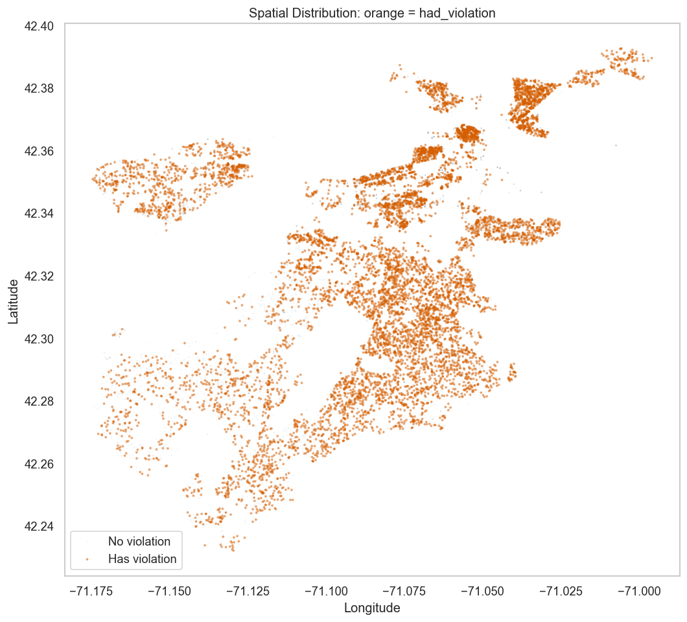

this gives us a clear look of the distribution of violations across Boston.
<br>
<br>

## 7. Model Training and Evaluation

Notebook 05 trains five risk-ranking approaches:

1. **Overall Rate Baseline** - gives every property the same risk score, which is the training-set violation rate.
2. **Age-Based Baseline** - ranks older buildings as higher risk. This checks whether building age alone is enough.
3. **Logistic Regression** - a simple and interpretable supervised model with class balancing.
4. **Random Forest** - a tree-based model that can capture non-linear patterns and feature interactions.
5. **Histogram Gradient Boosting** - a boosted tree model that usually works well for tabular data and can handle missing numeric values.

The data are split with a stratified train/test split so the rare positive class is represented in both sets. Because this is an inspection-prioritization problem, the main threshold is the top 10% of predicted risk scores rather than a fixed 0.50 probability cutoff.

The main metrics are:

- **ROC-AUC:** measures overall ranking quality across thresholds.
- **Average precision:** measures ranking quality when the positive class is rare.
- **Top-10% violation rate:** shows the violation rate among the highest-risk 10% of properties.
- **Top-10% lift:** compares the top-10% violation rate with the overall violation rate.
- **Captured violation share:** shows how many positive properties are found inside the top 10% risk group.

---

## Results

The best model is Histogram Gradient Boosting.

| Metric | Value |
|---|---:|
| Overall violation rate | 5.61% |
| Top 10% model-selected violation rate | 22.81% |
| Top-10% lift | 4.07x |
| Captured violation share | 40.66% |
| ROC-AUC | 0.810 |
| Average precision | 0.213 |
| Base positive rate | 0.056 |

These results mean that if inspectors randomly selected properties, the expected historical violation rate would be about 5.61%. If they instead reviewed the top 10% highest-risk properties ranked by the Histogram Gradient Boosting model, the observed violation rate in that group would be 22.81%. This is about 4.07 times better than random selection, and that top 10% group captures 40.66% of all positive properties in the test set.

The main conclusion is that the model is useful as a prioritization tool. It does not tell us that a property will definitely have a future violation, but it can help rank properties when inspection resources are limited. In practice, a city agency could use this type of score to decide which properties may deserve earlier review, then combine it with inspector judgment and local policy constraints.

A simple alternative would be to rank with the highest historical violation counts. This is useful for monitoring repeat properties, but it mostly reuses the outcome we are trying to predict. Our goal is different. We exclude violation-count fields and use property structure, condition, location, and neighborhood context to learn a risk score that can generalize beyond properties already recorded with many violations.

---

### Model Comparison

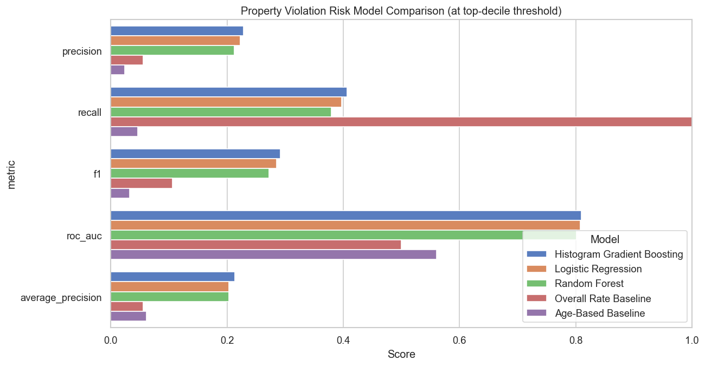

The supervised models perform much better than the overall-rate and age-only baselines. This suggests that the full feature set adds value beyond a simple building-age rule.

### Confusion Matrix at Top-Decile Threshold

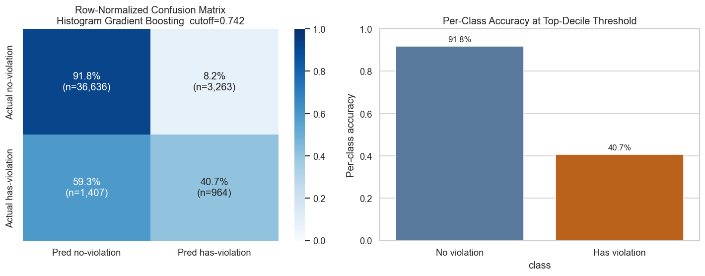

At the top-decile threshold, the model marks only the highest-risk 10% of properties for review. Within this setup, it captures 40.7% of properties with historical violations, while only 8.2% of no-violation properties are flagged as high risk. This fits the goal of building a smaller inspection group that contains many more positive cases than random selection.

### Top-10% Prioritization Lift

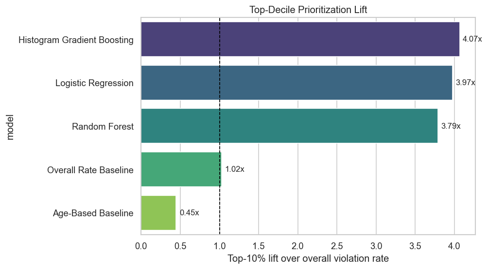

Histogram Gradient Boosting has the highest top-decile lift at 4.07x. Logistic Regression and Random Forest are close to 4x as well. This means the pattern is not coming from only one model.

### Feature Importance

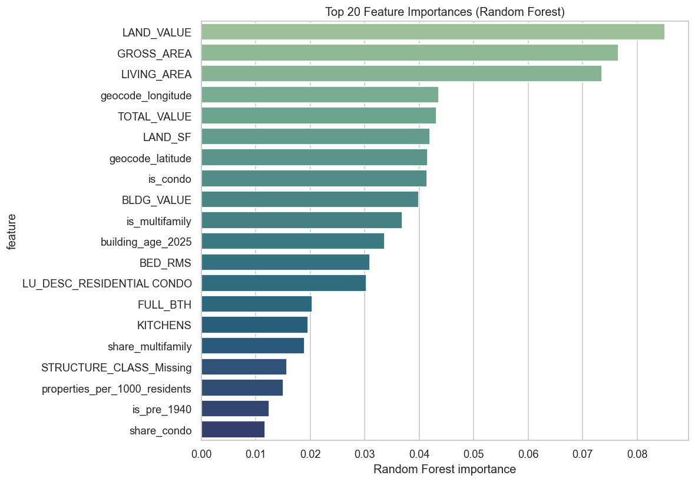

The Random Forest importance plot highlights property value, area, location, condo/multifamily indicators, and building age. These importances are useful for interpretation, but they should not be read as causal effects.

### Predicted-Risk Distribution

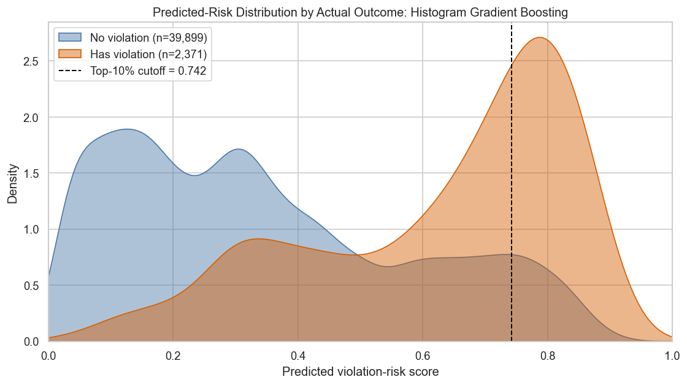

Properties with historical violations tend to receive higher risk scores than properties without violations. The two groups still overlap, but the shift shows that the model learned useful ranking signals.

### ROC and Precision-Recall Curves

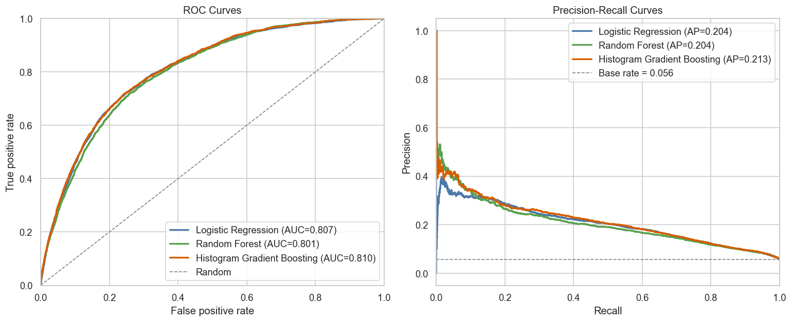

The best model reaches ROC-AUC 0.810 and average precision 0.213, well above the base positive rate of 0.056.

### Cumulative Gain Curve

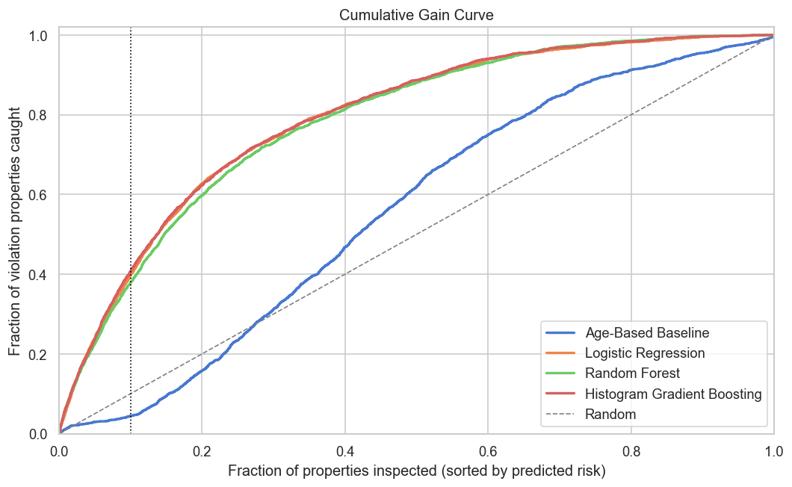

The cumulative gain curve shows what happens as the inspection group gets larger. In our result, reviewing the top 10% highest-risk properties captures about 40.7% of historical violation properties, compared with about 10% under random selection.
<br>
<br>

## 8. Limitations

The violation data only covers cases formally filed with Boston ISD. A property may have real housing problems that were never reported, inspected, or recorded. Because of this, `had_violation = 0` does not always mean that the property had no problems. It only means that no violation record was matched to that parcel in our data.

Both main datasets were created for administrative purposes, not for prediction. The violation records are enforcement logs, and the Property Assessment file was designed for tax valuation. Some condition fields may reflect assessor judgment rather than a consistent housing-risk standard. As a result, the model learns which properties look similar to historically recorded cases, not all true housing risk.

The target label also depends on spatial matching. Each violation was snapped to the nearest residential parcel within 50 meters. This threshold is reasonable for this project, but it has not been validated against an external ground truth. In dense areas, or when coordinates are imprecise, some violations may be assigned to a nearby parcel instead of the exact property.

The positive class is still small at the property level. Only 5.61% of residential properties have a snapped historical violation. Class balancing helps during training, but the model is still better suited for ranking than for making hard yes-or-no decisions.

Finally, the evaluation uses a random stratified train/test split rather than a time-based split. This means the result shows how well the model recognizes properties similar to historical violation properties. It is not a strict future forecasting test. Feature importance and location signals should also be interpreted carefully, because they show association rather than causation.
<br>
<br>

## 9. Repository Structure

```text
data/raw/            Raw violation data
data/external/       Supporting external datasets
data/processed/      Cleaned data, feature tables, predictions, and metrics
figures/             Final figures for the report and presentation
notebooks/           pipeline and main code
tests/               
```
<br>
<br>

## 10. Testing

Run:

```bash
make test
```

The tests check that:

1. key files exist
2. feature metadata excludes leakage
3. metrics file has expected models and key columns
<br>
<br>

## 11. Contributing :)

1. Keep notebooks runnable.
2. Keep Notebook 05 as the canonical final modeling notebook.
3. Do not use target-derived fields such as `violation_count`, `had_recent_violation`, or violation dates as model inputs.
4. Keep figures and metrics reproducible from committed code and documented data files.
